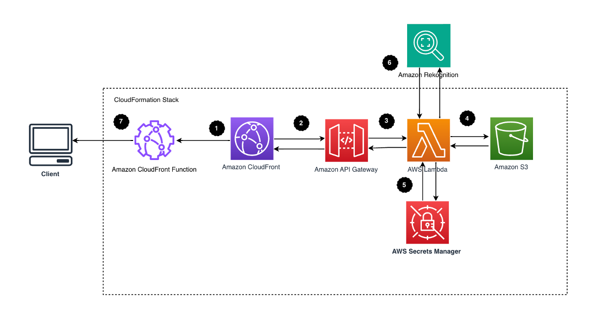
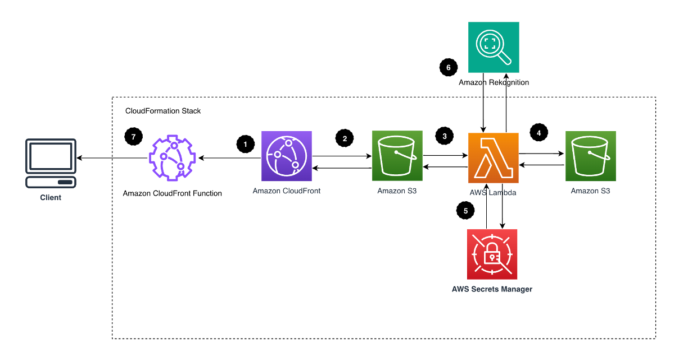

**[Dynamic Image Transformation for Amazon CloudFront](https://aws.amazon.com/solutions/implementations/dynamic-image-transformation-for-amazon-cloudfront/)** | **[🚧 Feature request](https://github.com/aws-solutions/serverless-image-handler/issues/new?assignees=&labels=enhancement&template=feature_request.md&title=)** | **[🐛 Bug Report](https://github.com/aws-solutions/serverless-image-handler/issues/new?assignees=&labels=bug&template=bug_report.md&title=)** | **[❓ General Question](https://github.com/aws-solutions/serverless-image-handler/issues/new?assignees=&labels=question&template=general_question.md&title=)**

**Note**: If you want to use the solution without building from source, navigate to [Solution Landing Page](https://aws.amazon.com/solutions/implementations/dynamic-image-transformation-for-amazon-cloudfront/).

## Example request

```
{
  // either bucket + key or link
  bucket: <bucket-name>,
  key: <image-key>,
  link: <image-link>,
  edits: {
    blurResize: {
      size: 400,    // output square image size
      blur: 6,
    },
  },
}
```

## Table of Content

- [Solution Overview](#solution-overview)
- [Architecture Diagram](#architecture-diagram)
- [AWS CDK and Solutions Constructs](#aws-cdk-and-solutions-constructs)
- [Customizing the Solution](#customizing-the-solution)
  - [Prerequisites for Customization](#prerequisites-for-customization)
    - [1. Clone the repository](#1-clone-the-repository)
    - [2. Unit Test](#2-unit-test)
    - [3. Build & Deploy](#3-build-and-deploy)
- [Collection of operational metrics](#collection-of-operational-metrics)
- [External Contributors](#external-contributors)
- [License](#license)

# Solution Overview

The Dynamic Image Transformation for Amazon CloudFront solution helps to embed images on websites and mobile applications to drive user engagement. It uses [Sharp](https://sharp.pixelplumbing.com/en/stable/) to provide high-speed image processing without sacrificing image quality. To minimize costs of image optimization, manipulation, and processing, this solution automates version control and provides flexible storage and compute options for file reprocessing.

This solution automatically deploys and configures a serverless architecture optimized for dynamic image manipulation. Images can be rendered and returned spontaneously. For example, an image can be resized based on different screen sizes by adding code on a website that leverages this solution to resize the image before being sent to the screen using the image. It uses [Amazon CloudFront](https://aws.amazon.com/cloudfront) for global content delivery and [Amazon Simple Storage Service](https://aws.amazon.com/s3) (Amazon S3) for reliable and durable cloud storage.

For more information and a detailed deployment guide, visit the [Dynamic Image Transformation for Amazon CloudFront](https://aws.amazon.com/solutions/implementations/dynamic-image-transformation-for-amazon-cloudfront/) solution page.

# Architecture Diagram

Dynamic Image Transformation for Amazon CloudFront supports two architectures, one using an Amazon API Gateway REST API, and another using S3 Object Lambda. The Amazon API Gateway REST API architecture maintains the structure used in v6.3.3 and below of the Dynamic Image Transformation for Amazon CloudFront. The S3 Object Lambda architecture maintains very similar functionality, while also allowing for images larger than 6 MB to be returned. For more information, refer to the [Architecture Overview](https://docs.aws.amazon.com/solutions/latest/serverless-image-handler/architecture-overview.html) in the implementation guide.

The AWS CloudFormation template deploys an Amazon CloudFront distribution, Amazon API Gateway REST API/S3 Object Lambda, and an AWS Lambda function. Amazon CloudFront provides a caching layer to reduce the cost of image processing and the latency of subsequent image delivery. The Amazon API Gateway/S3 Object Lambda provides endpoint resources and triggers the AWS Lambda function. The AWS Lambda function retrieves the image from the customer's Amazon Simple Storage Service (Amazon S3) bucket and uses Sharp to return a modified version of the image. Additionally, the solution generates a CloudFront domain name that provides cached access to the image handler API. There is limited use of CloudFront functions for consistency and cache hit rate purposes.

## Default Architecture



## S3 Object Lambda Architecture



# AWS CDK and Solutions Constructs

[AWS Cloud Development Kit (AWS CDK)](https://aws.amazon.com/cdk/) and [AWS Solutions Constructs](https://aws.amazon.com/solutions/constructs/) make it easier to consistently create well-architected infrastructure applications. All AWS Solutions Constructs are reviewed by AWS and use best practices established by the AWS Well-Architected Framework. This solution uses the following AWS Solutions Constructs:

- [aws-cloudfront-s3](https://docs.aws.amazon.com/solutions/latest/constructs/aws-cloudfront-s3.html)
- [aws-cloudfront-apigateway-lambda](https://docs.aws.amazon.com/solutions/latest/constructs/aws-cloudfront-apigateway-lambda.html)

In addition to the AWS Solutions Constructs, the solution uses AWS CDK directly to create infrastructure resources.

# License

Copyright Amazon.com, Inc. or its affiliates. All Rights Reserved.  
SPDX-License-Identifier: Apache-2.0
